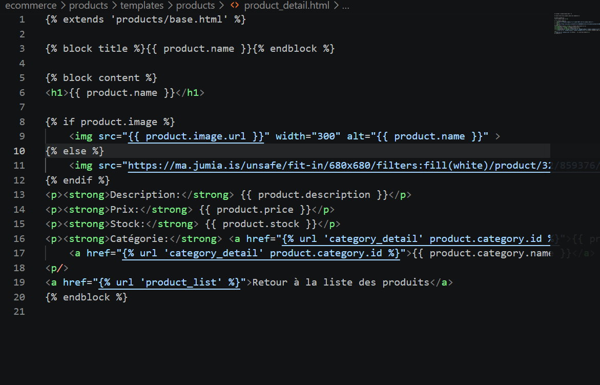
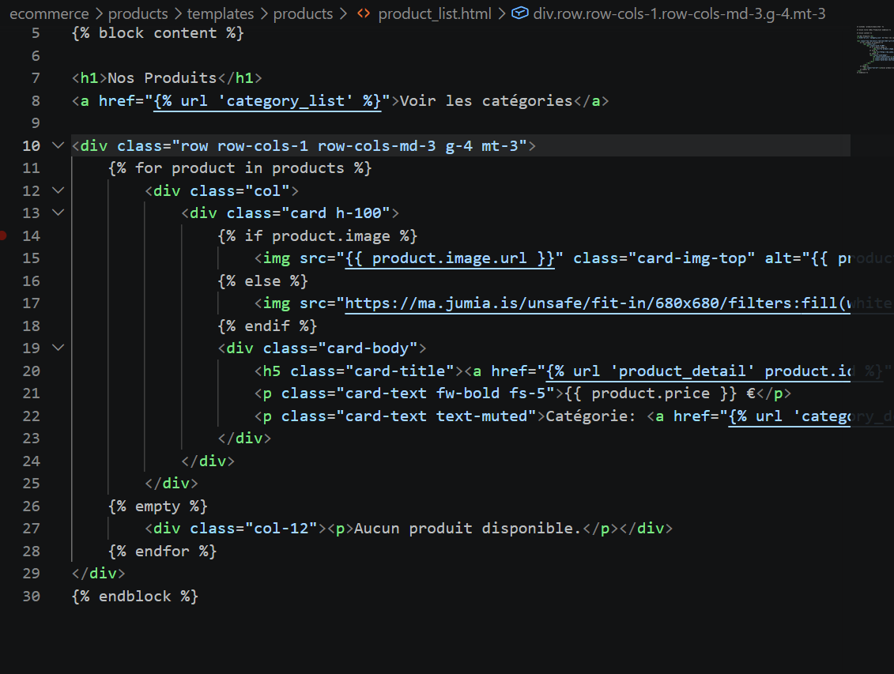

# Projet E-commerce en Django

Ce projet est une application web e-commerce développée avec Django. Il a été réalisé en plusieurs étapes (Ateliers) pour mettre en place la structure du projet, la base de données PostgreSQL, les modèles, les vues, et l'intégration des templates HTML avec héritage. Ce document trace mon avancement sur le projet, étape par étape.

## 🎯 Objectifs du Projet
- Création d'une application e-commerce avec le framework Django.
- Gestion des produits et des catégories de produits.
- Mise en place et configuration d'une base de données **PostgreSQL**.
- Gestion de l'upload d'images via le système de médias de Django.
- Utilisation du système de templates Django (héritage pour optimiser le code).

---

## 🚀 Étapes de Réalisation (Démarche)

### Atelier 1 : Initialisation et Configuration de Base
Dans cette première étape, la structure de base du projet a été mise en place.

1. **Environnement et Installation :** Création de l'environnement virtuel et installation de Django via le terminal.
   - 
   - 
   - 
   
2. **Création du Projet et de l'Application :** 
   - Initialisation du projet principal `ecommerce`.
   - Création de l'application `products` et enregistrement de celle-ci dans la liste des `INSTALLED_APPS` (fichier `settings.py`).
   - 
   - 

3. **Vues et Routage (URLs) :**
   - Création de fonctions basiques dans `views.py` (de l'app `products`).
   - 
   - Configuration des URLs au niveau de l'application `products` et liaison au fichier `urls.py` principal du projet.
   - 
   - 

4. **Templates Initiaux :** Création des fichiers HTML basiques pour l'affichage (`product_list.html` et `product_detail.html`).
   - 
   - 

5. **Démarrage :** Lancement du serveur de développement et test de l'affichage.
   - 
   - 
   - 

### Atelier 2 : Modèles, Base de Données et Administration
Cette étape s'est concentrée sur la persistance des données, la relations entre entités et l'interface d'administration.

1. **Création des Modèles de Données :**
   - Création du modèle `Product` et `Category` dans `models.py`.
   - 
   - 
   - 

2. **Migrations et Mise à Jour de la Base de Données :**
   - 
   - 
   - 

3. **Interface d'Administration :**
   - Enregistrement des modèles et personnalisation dans `admin.py`.
   - 
   - 

4. **Intégration de PostgreSQL :**
   - Configuration du fichier `settings.py` pour basculer de SQLite vers PostgreSQL.
   - 
   - 

5. **Gestion des Fichiers Médias (Images) :**
   - 
   - 

6. **Mise à jour des Vues, URLs et Templates :** 
   - Adaptation au vrai schéma de BDD.
   - 
   - 
   - 
   - 
   - 
   - 

### Atelier 3 : Optimisation des Templates (Héritage)
Cette dernière étape a permis de factoriser le code HTML pour respecter le principe DRY.

1. **Création du Template de Base :** 
   - Création d'un fichier `base.html` structurant le socle commun des pages.
   - 

2. **Héritage dans les vues existantes :** 
   - Utilisation de ``.
   - 
   - 

3. **Vérification de la base de données :**
   - Preuve des migrations vers la base de données PostgreSQL finales.
   - 
   - 

---

## 🛠️ Technologies Utilisées
- **Backend :** Python, Django
- **SGBD (Base de données) :** PostgreSQL
- **Frontend :** HTML, CSS (moteur de Template Django)

---

## 📦 Instructions d'Installation (Local)

Si vous souhaitez cloner et tester ce projet en local, voici la marche à suivre :

1. **Cloner le dépôt :**
   ```bash
   git clone <URL_DU_DEPOT_GITHUB>
   cd ecommerce
   ```

2. **Créer et activer l'environnement virtuel :**
   ```bash
   # Création
   python -m venv myenv
   
   # Activation sous Windows
   myenv\Scripts\activate
   
   # Activation sous macOS / Linux
   source myenv/bin/activate
   ```

3. **Installer les dépendances requises :**
   ```bash
   pip install django psycopg2   # psycopg2 est le connecteur pour PostgreSQL
   ```

4. **Configuration de la Base de Données :**
   - Vous devez disposer d'un serveur PostgreSQL local ou distant.
   - Dans le fichier `ecommerce/settings.py`, modifiez le dictionnaire `DATABASES` avec vos propres informations d'identification (Nom DB, Utilisateur, Mot de passe).

5. **Exécuter les Migrations :**
   ```bash
   python manage.py makemigrations
   python manage.py migrate
   ```

6. **Créer le compte Administrateur :**
   ```bash
   python manage.py createsuperuser
   ```

7. **Démarrer le Serveur :**
   ```bash
   python manage.py runserver
   ```
   Rendez-vous ensuite sur `http://127.0.0.1:8000/` pour visualiser l'application, et sur `http://127.0.0.1:8000/admin/` pour gérer les produits/catégories.
